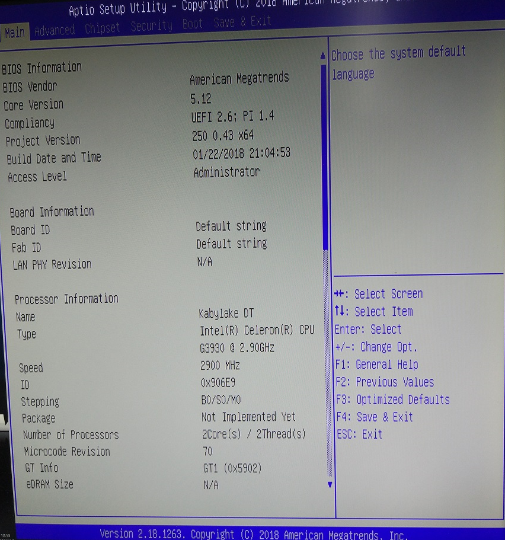
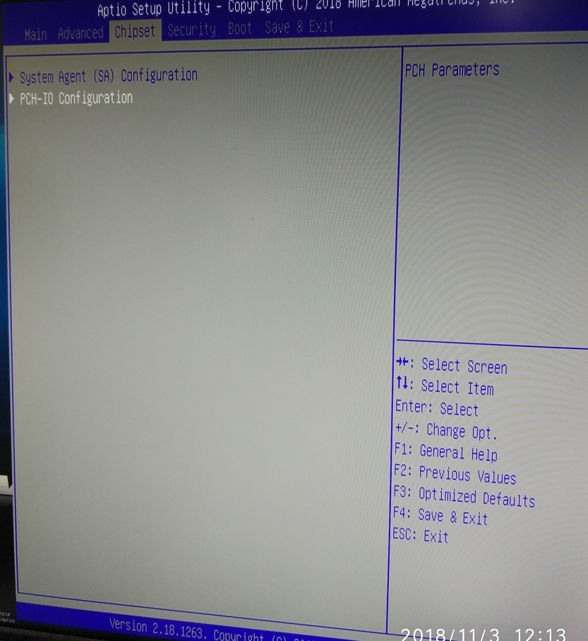
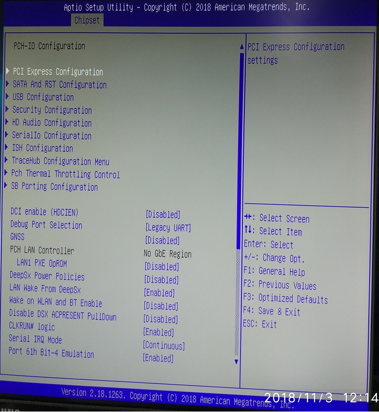
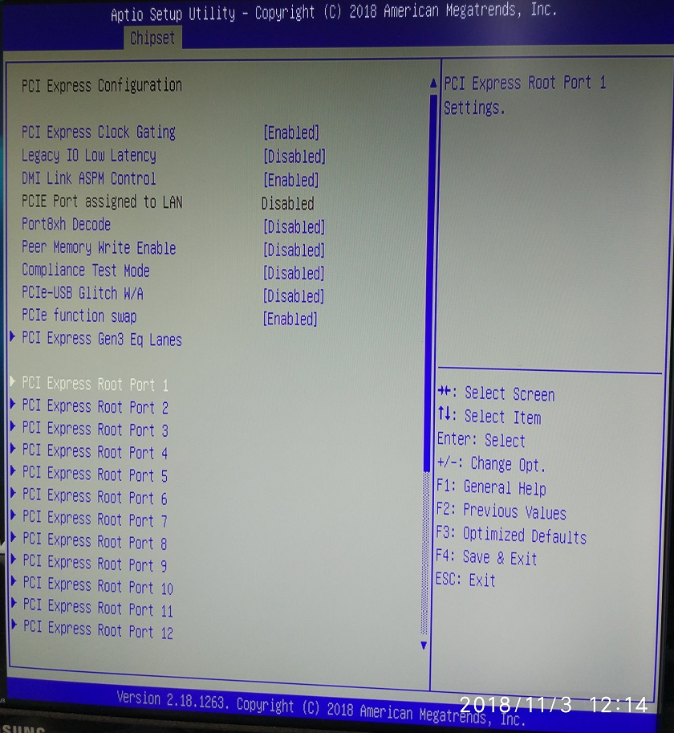
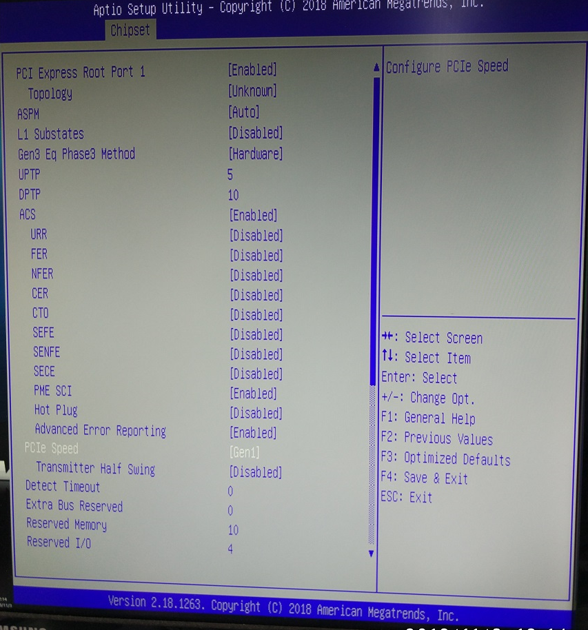
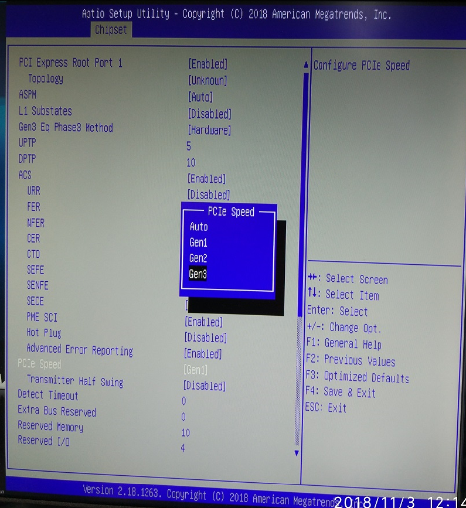
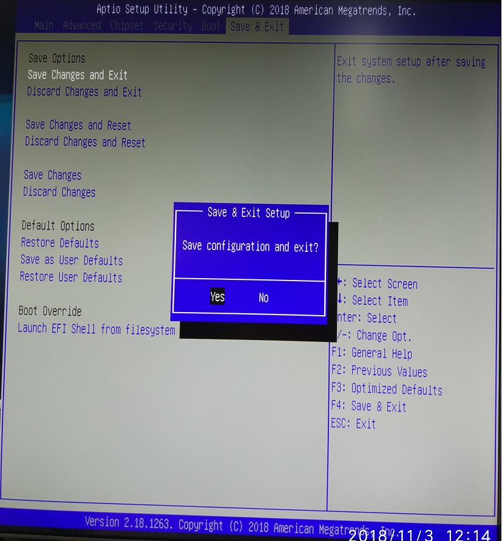

1.	Press the delete key to enter BIOS after power on

2.	Select chipset tab and enter PCH-IO Configuration

3.	enter PCI Express Configuration 

4.	enter PCI Express Root Port 1 ~ 12

5.	set PCIe speed to Gen3

6.	save and exit

