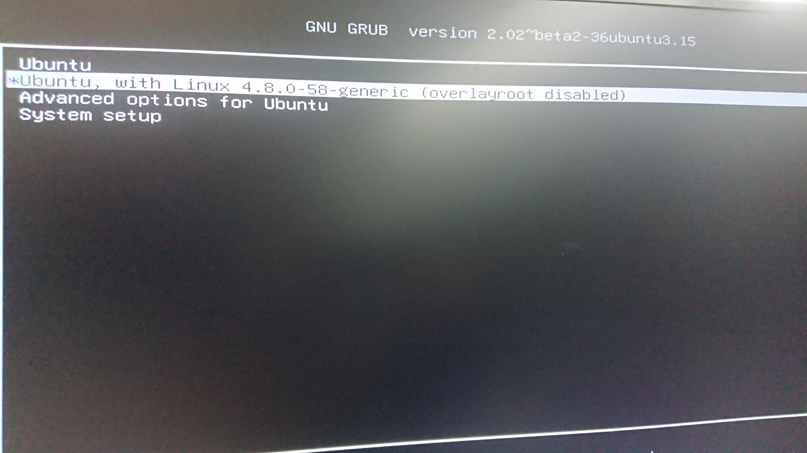
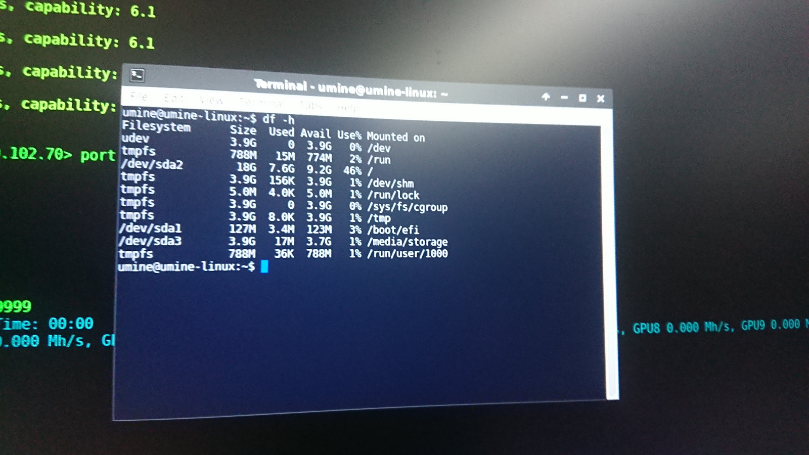
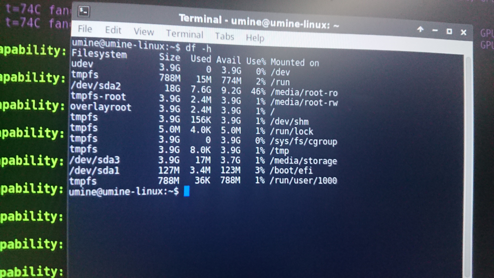

# U mine Pro Miner

## How to start up the machine for the first time.
Assuming you have installed all the GPUs and internal cables.Plug in:

* Ethernet Cable
* HDMI (only when setup)
* 220/110v Power cable to power supply unit.
* Mouse and Keyboard (only when setup)

The rig should boot up automatically into BIOS loader, and boot up screen should have U mine logo displayed. And it should 
go to linux system automatically.

The mining session screen should appear after several seconds when Linux Desktop is shown. 

Now you can hit close the window and:

### Change default wallet address
double click `ewal.txt` on the desktop, change... and hit 'save' and reboot the system by click reboot button in xubuntu top left menu.

### Change to your own mining script
double click `customminer.sh` on the desktop, change... and hit 'save' and reboot the system by click reboot button in xubuntu top left menu.

### Overclocking your nvidia GPUs
double click `custom_oc.sh` on the desktop, change... and hit 'save' and reboot the system by click reboot button in xubuntu top left menu.


## Diagnose

### Network Connections
When powered up in to Linux, the OS will run DHCP client the accquire an IP address.

If error message shows "waiting for mining session", there is some commands you can use:
```
ifconfig eth0
route -n
ping google.com
```

### GPUs

#### Commands for NVIDIA Cards
```
lspci | grep -i nvidia
nvidia-smi
```
### Commands for AMD Cards
```
lspci | grep -i amd
```

## U mine Linux mining porgram init process

### /etc/rc.local
Here we start `/opt/umine_linux/start.sh`

### /home/umine/.config/autostart
Here we start `byobu` session to enable view is print into the Desktop.


## ADVANCED TOPIC: Default linux user account 

The default user is `umine`, and password is `novotech`. `root` user is not setup, but you can use sudo command instead.

## How to enter R/W mode on U mine system (base on Ubuntu 16.04)

This system by default has a ram overlay filesystem on top of ext4. Your writes will be lost if rebooted. You need to do the following step to disable protection temporarily.

Startup the machine, the boot menu should be like this.



The first item is protected mode, the second one is unprotected writable mode. You can do write operation on system partition by booting from this item until shutdown. Notice that in this mode system will not be protected from power failure, you should do normal shutting down, by using poweroff command or power off button on GUI.

## How to determine the protection mode on the system

When root partition (/) is mounted on /dev/sda2, the system is on writable (unprotected) mode. In this mode, you should do normal shutdown process to prevent data loss.



When root partition is mounted on overlayroot, the system is on read-only (protected) mode.


