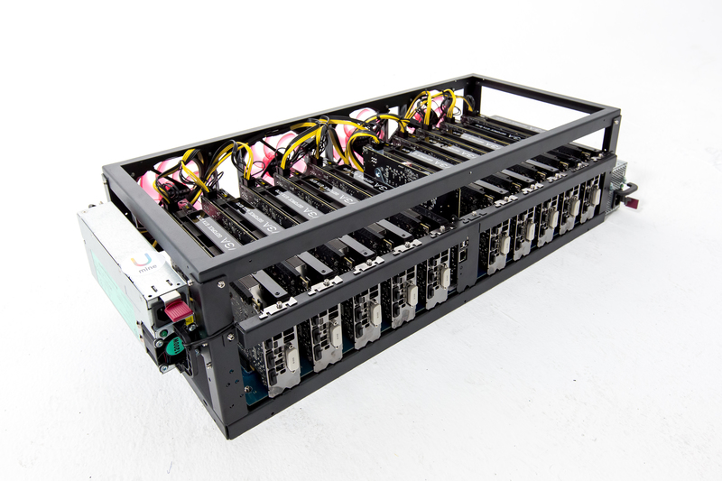

# U mine Pro Miner User's Manual

Note we are working on this, and if you want to see our miner, please visit https://umine.io

## How to start up the machine for the first time.
Assuming you have installed all the GPUs and internal cables.



Plug in:

* Ethernet Cable
* HDMI (to the CPU Motherboard)
* 220/110v Power cable to power supply unit.
* Mouse and Keyboard (only when setup)

The rig should boot up automatically into BIOS loader, and boot up screen should have U mine logo displayed. And it should 
go to linux system automatically.

The mining session screen should appear after several seconds when Linux Desktop is shown. 

Now you can hit close the window and:

### Change default wallet address
Double click `Wallet Config` on the desktop. Set line `EWAL="(Your wallet)"`, ethereum or z-cash wallet address is supported. If you want to use other pool server, set line `EPOOL="(Pool server)"` (if this line does not exist, add it as a new line). Worker number can also be set by line `EWORKER="(Your worker number)"` (if this line does not exist, add it as a new line), don't set `EWORKER` if you don't want to use it. Then click 'save' and reboot the system by click reboot button in xubuntu top left menu.

### Change to your own mining script
double click `Custom Miner Script` on the desktop. Write your own mining script inside, and don't forget to change `CUSTOMMINER="0"` to `CUSTOMMINER="1"`. There are some example lines inside. Click 'save' and reboot the system by click reboot button in xubuntu top left menu

### Overclocking your nvidia GPUs
double click `Custom OC Script` on the desktop. Write your own overclock script inside, and don't forget to change `CUSTOMOC="0"` to `CUSTOMOC="1"`. There are some example lines inside. Click 'save' and reboot the system by click reboot button in xubuntu top left menu.

## Normal Working Condition
* Only Power and Ethernet is required
* -10c~30c Room temperature

For powerful GPUs, we recommand some air flow for the machine, either use 12cm fan installed on the back of the rig or setup some air flow in the room.

The GPUs should report its temperature around 60c~85c.

## Diagnose
Use `Ctrl+Alt+t` or `Super/Win+t` to bring up a command terminal.

### Network Connections
When powered up in to Linux, the OS will run DHCP client the accquire an IP address.

If error message shows "waiting for mining session", there is some commands you can use:
```
ifconfig eth0
route -n
ping google.com
```

### GPUs

#### Commands for NVIDIA Cards
```
lspci | grep -i nvidia
nvidia-smi
```
#### Commands for AMD Cards
```
lspci | grep -i amd
clinfo
```

### Miner Process(es)
```
ps aux | grep eth
```

## U mine Linux mining program init process

### /etc/rc.local
Here we start `/opt/umine_linux/go.sh` in byobu seesion, and start watchdog.

### /home/umine/.config/autostart
Here we start overclock script and run `byobu` session to enable view is print into the Desktop.

## Software & Hardware Watchdog
Script `/opt/umine_linux/hwwd.sh` will use USB serial watchdog `/dev/ttyUSB0`. If there is no hash output or the system halted for more than 3 min, the system will be reset. If hardware watchdog is not connected, when watchdog is triggered, software reboot will be done instead.

## Default Linux user account
The default user is `umine`, and password is `novotech`. `root` user is not setup, but you can use sudo command instead.

## Recovery disk from USB disk
You need a 16GB or larger USB disk to setup the image. You can download the recovery image from our offical website.

On Linux, use commands below to write image to your USB disk (WARNING: the data on the USB disk will be overwritten!)
```
sudo umount (your USB disk device)
gunzip -c (image file) | sudo dd of=(your USB disk device) bs=16M
sync
```

On Windows, you should extract the file first, and use some disk image utils like Win32 Disk Imager to write it to your USB disk.

Then you can insert the USB disk to miner machine, and power on the machine. Recovery will be done automatically, if the system does not boot from USB disk, you may need to press F12 at startup, and select the USB disk to boot from it.

## ADVANCED TOPIC: How to enter R/W mode on U mine system (base on Ubuntu 16.04)

This system by default has a RAM overlay filesystem on top of ext4. Your changes will be lost if rebooted. 

If you do need to modify the content, please follow the steps to disable protection temporarily.

Startup the machine, the boot menu should be like this.


The first item is protected mode, the second one is unprotected writable mode. You can do write operation on system partition by booting from this item until shutdown. Notice that in this mode system will not be protected from power failure, you should do normal shutting down, by using `poweroff` command or power off button on GUI.

### How to determine the protection mode on the system

When root partition (/) is mounted on `/dev/sda2`, the system is on writable (unprotected) mode. In this mode, you should do normal shutdown process to prevent data loss.


When root partition is mounted on overlayroot, the system is on read-only (protected) mode.


