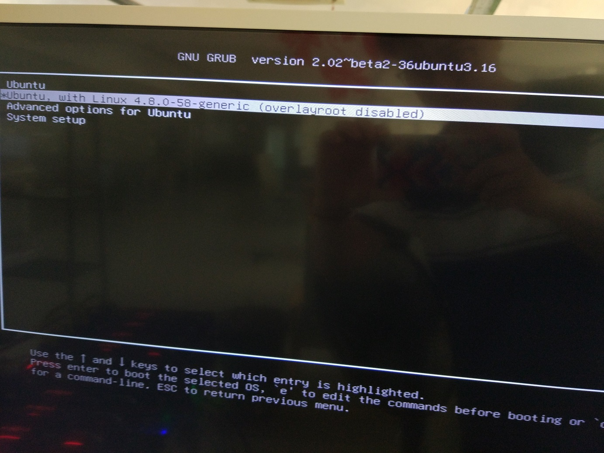
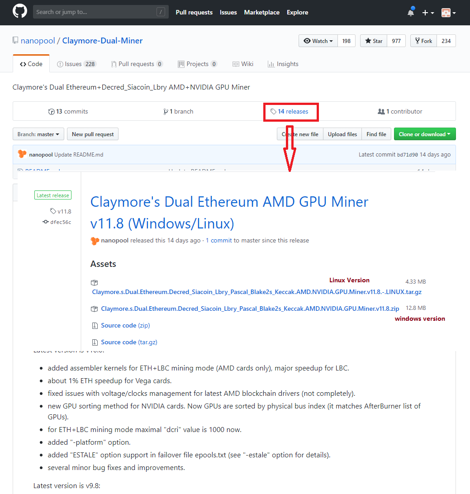
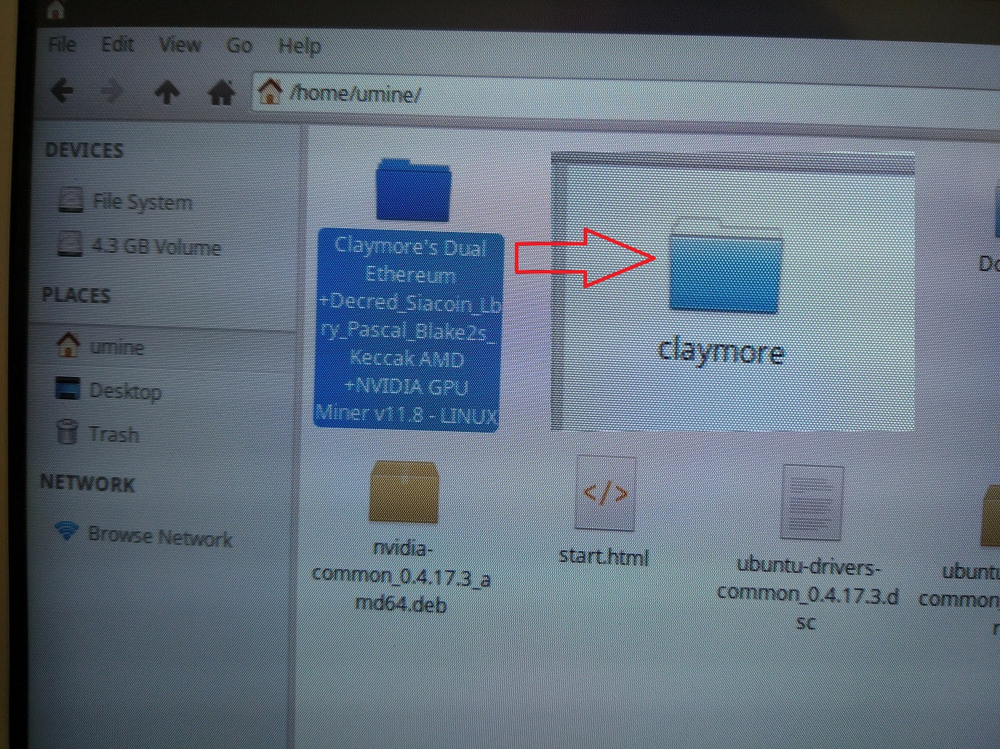
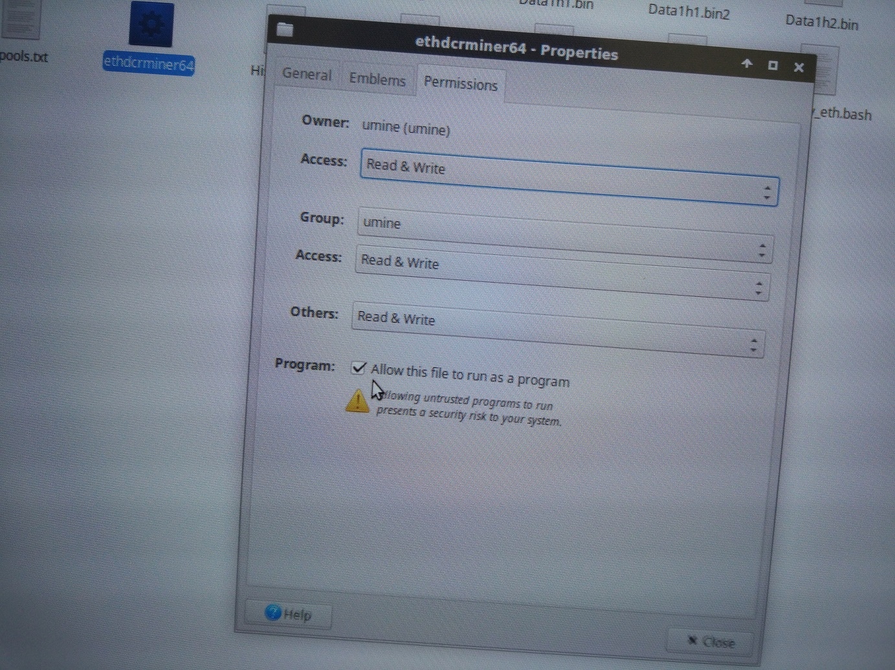
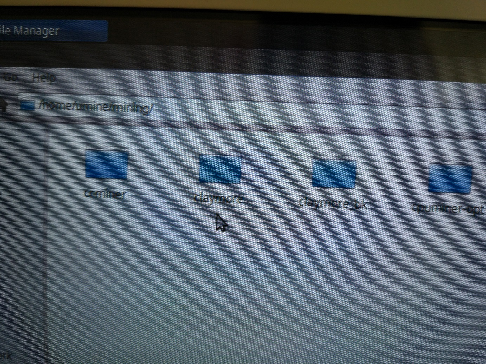

# Step 1.

## select the 2nd item from the boot menu

# Step 2.

## Download updated claymore version from github.com.

# Step 3.

## unzip the file and rename the folder name to 'claymore'.

# Step 4.

## allow the file 'ethdcrminer64' run as a program.

# Step 5.

## copy the folder 'claymore' to the path '/home/umine/mining/'.

# Step 6.

## reboot
